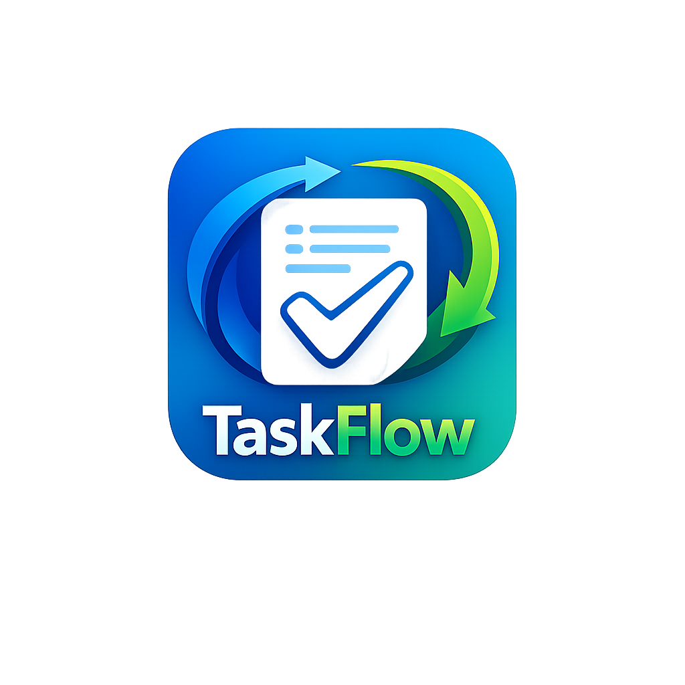
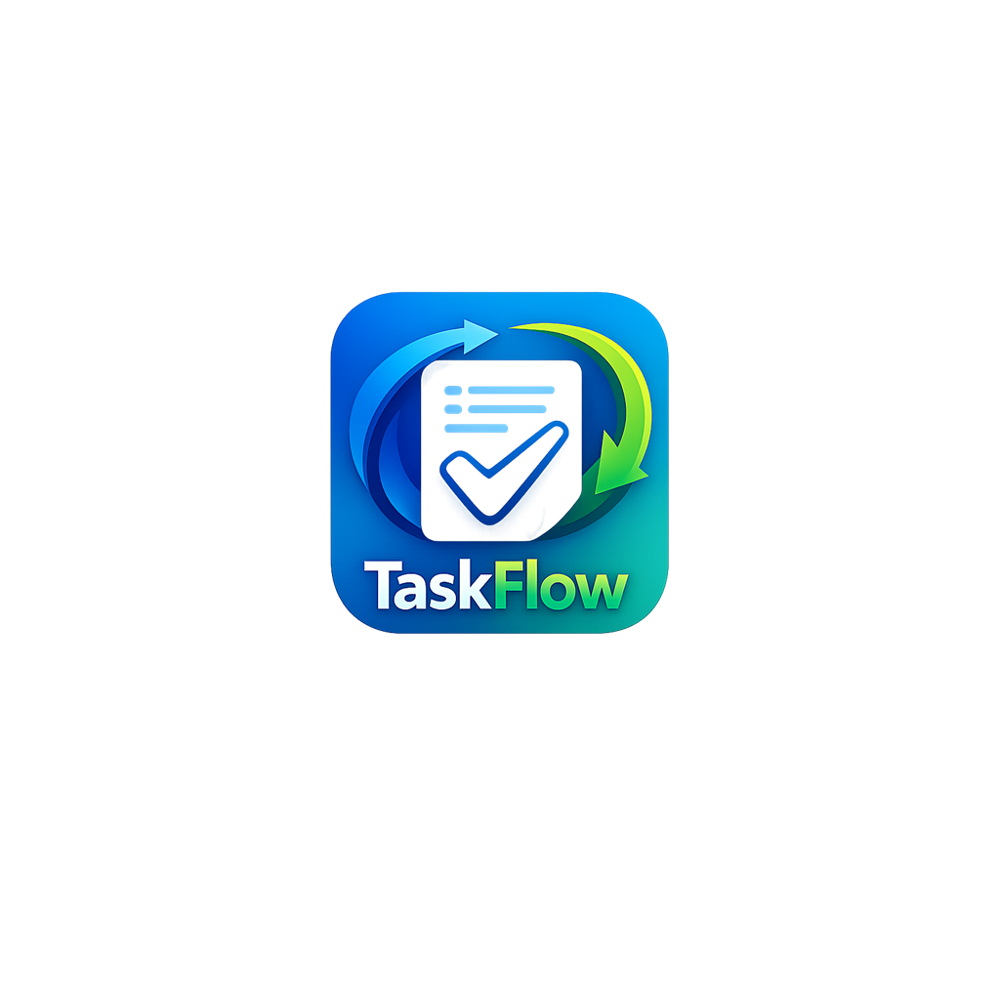

# TaskFlow

TaskFlow is a Flutter task manager app for organizing projects and tasks. It supports user authentication, project creation, task tracking, priorities, statuses, local caching, and light/dark theme preferences.

## Submission

- Public GitHub Repository: https://github.com/3madhani/taskflow
- APK: build the split APK files with the command in the APK section below.
- Screenshots: included in this README from `assets/app_screenshot/`.

## App Icon And Splash

| App Icon | Splash Icon |
|---|---|
|  |  |

## Screenshots

| | |
|---|---|
|  |  |
|  |  |
|  |  |
|  |  |
|  |  |

## Features

- Register, login, and logout with Supabase Auth.
- Create, update, and delete projects.
- Add and manage tasks inside projects.
- Set project and task status and priority.
- Cache projects, tasks, and settings locally with Hive.
- Switch between light and dark themes.
- Pick project images from the device.

## Dependencies

Main packages used in this app:

- `flutter_bloc` and `bloc` for state management.
- `go_router` for app navigation.
- `supabase_flutter` for authentication and remote database access.
- `hive` and `hive_flutter` for local storage.
- `get_it` and `injectable` for dependency injection.
- `freezed_annotation`, `json_annotation`, and generated files for models.
- `google_fonts` for typography.
- `image_picker` for project image selection.
- `dartz` for functional result handling.
- `path` and `path_provider` for file/path support.

Development packages:

- `build_runner`
- `hive_generator`
- `injectable_generator`
- `freezed`
- `json_serializable`
- `flutter_lints`
- `flutter_launcher_icons`
- `flutter_native_splash`

## How To Run

1. Install dependencies:

```bash
flutter pub get
```

2. Generate required files:

```bash
dart run build_runner build --delete-conflicting-outputs
```

3. Run the app:

```bash
flutter run
```

## APK Build

To create smaller APK files for sharing, build split APKs by Android ABI:

```bash
flutter build apk --release --split-per-abi
```

The generated files are created in:

```text
build/app/outputs/flutter-apk/
```

Expected release APK files:

- `app-armeabi-v7a-release.apk`
- `app-arm64-v8a-release.apk`
- `app-x86_64-release.apk`

For most modern Android phones, share `app-arm64-v8a-release.apk`.

## CI/CD

This repository includes a GitHub Actions workflow at `.github/workflows/android-build.yml`.

The workflow:

- Installs Flutter and Java.
- Runs `flutter pub get`.
- Generates required code with `build_runner`.
- Builds split release APKs with `flutter build apk --release --split-per-abi`.
- Uploads the APK files as GitHub Actions artifacts.
- Attaches APK files to a GitHub Release when a release is created.

APK files should not be committed to the repository because `/build/` is ignored. Download the generated APK files from the GitHub Actions run or from a GitHub Release.

## Project Structure

```text
lib/
├── main.dart          # App startup, Hive, Supabase, and dependency setup
├── app.dart           # Root widget, router, themes, and BLoC providers
├── core/              # Shared config, routing, storage, theme, helpers, widgets
└── features/
    ├── auth/          # Authentication data, domain, and UI
    ├── projects/      # Project data, domain, and UI
    ├── tasks/         # Task data, domain, and UI
    ├── profile/       # Profile screen and theme settings
    └── shell/         # Main app navigation shell
```

## Important Notes

- The app uses Supabase for authentication and remote project/task data.
- Supabase configuration is stored in `lib/core/network/supabase_config.dart`.
- Hive is used for local caching through `projects_box`, `tasks_box`, and `settings_box`.
- Code generation is required after changing models, Hive adapters, or dependency injection files.
- The current release build is configured with the debug signing config, so it is suitable for direct testing/sharing, not Play Store publishing.
